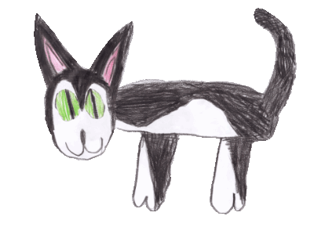

# Весёлый сущ

Небольшая браузерная игра о загадочном существе, которое бежит навстречу приключениям, набирает очки и перепрыгивает всё подозрительное.



## Первая версия

- бесконечный забег;
- прыжок по пробелу или касанию;
- препятствия и постепенное ускорение;
- текущий счёт и локальный рекорд;
- адаптивный интерфейс для компьютера и телефона.

## Технологии

- PHP 8.3 и Laravel 13;
- MariaDB для будущей таблицы рекордов;
- Blade;
- JavaScript для игрового цикла;
- Nginx на VPS.

## Запуск

```bash
composer install
cp .env.example .env
php artisan key:generate
php artisan serve
```

После запуска игра будет доступна на `http://127.0.0.1:8000`.

## Тесты

```bash
php artisan test
./vendor/bin/pint --test
```

Рабочая версия: [https://playsush.mooo.com](https://playsush.mooo.com)
